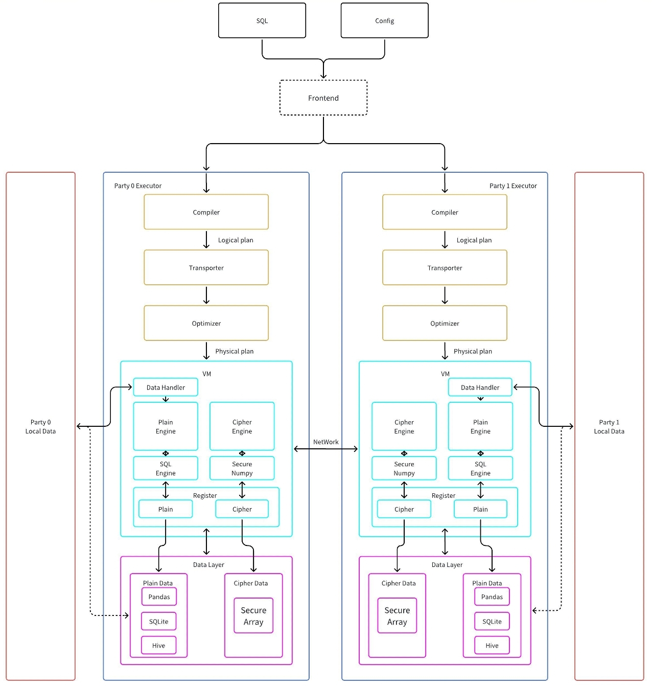

# PETSQL

PETSQL is a framework for secure collaborative data analysis based on Secure Multi-Party Computation (MPC), and its core capabilities are supported by [PETAce](https://github.com/tiktok-privacy-innovation/PETAce). PETSQL is designed to be compatible with traditional SQL engines and primarily comprises the following parts:

- `Compiler` and `Transporter`: A compiler parses SQL statements and schema information into a structured logical execution plan. A transporter takes into account the characteristics of MPC and rewrites the logical execution plan into real processes.

- `Virtual Machine`: A virtual machine defines a series of interfaces that allow plug-and-play implementations to cater to different scenarios. It mainly includes two separate engines for plaintext and ciphertext that correspond to operations on unencrypted and encrypted data, respectively.

- `Data Layer`: A data layer abstracts various types of data, such as in-memory and database storage. This is an underlying architecture of the virtual machine that hides away discrepancies between data storage and formats to maximize code reuse.

The diagram below shows the overall architecture of PETSQL and the relationships between its various modules.

<figure>
<div align="center">

</div>
<div align="center">Architecture of PETSQL</div>
</figure>

## Getting Started

### Requirements

| System | Toolchain                     |
|--------|-------------------------------|
| Linux  | Python (==3.9), pip(>=23.3.1) Java 8, Maven(>=3.6.0)   |


### Building PETSQL

PETSQL depends on PETAce as the backend for secure multi-party computation. PETAce must be installed first. Please refer to [PETAce](https://github.com/tiktok-privacy-innovation/PETAce).

We assume that all commands presented below are executed in the root directory of PETSQL.
Then, build `java` using the following scripts:

```bash
cd java
mvn clean package
cd ..
cp ./java/target/petsql*.jar ./petsql/compiler/__binding/
```

Then, build `python` using the following scripts:

```bash
mkdir -p build/petsql
cp -r petsql/* build/petsql
cp setup.py build
cp requirements.txt build
cd build
python3 setup.py install
```

### Quick Start

Here we give a simple example to run protocols in PETSQL.

To run Party A

```shell
python3 ./example/example.py -p 0
```

To run Party B

```shell
python3 ./example/example.py -p 1
```

For more details, please refer to the example.


## Contribution

Please check [Contributing](CONTRIBUTING.md) for more details.

## Code of Conduct

Please check [Code of Conduct](CODE_OF_CONDUCT.md) for more details.

## License

This project is licensed under the [Apache-2.0 License](LICENSE).
